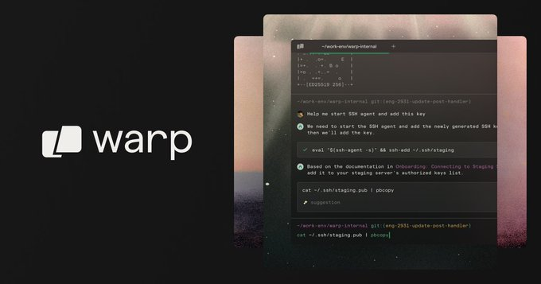

# Hello Bash/Shell

## Curso para aprender a trabajar con Bash (Bourne-again shell), línea de comandos, terminal y scripting desde cero y para principiantes

> ### Con soporte para Linux, macOS y Windows

### Proyecto realizado durante emisiones en directo desde [Twitch](https://twitch.tv/mouredev)
> ##### Si consideras útil el curso, apóyalo haciendo "★ Star" en el repositorio. ¡Gracias!

## 🆕 NUEVO: Curso desde cero [En desarrollo]

> [!IMPORTANT]
> 
> 🔴 PRÓXIMA CLASE EN DIRECTO: Jueves 14 de agosto a las 20:00h (España) en [Twitch](https://twitch.tv/mouredev)
> 
> 🗓️ CONSULTA EL HORARIO POR PAÍS Y CREA UN RECORDATORIO desde [Discord](https://discord.gg/GZR5DE4s?event=1392842868850429982)

## Clases

> #### **Descarga [Warp 2](https://mouredev.link/warp):** La terminal y entorno de desarrollo con IA que utilizaremos en el curso.

* Clase 1 [16/07/2025] - Introducción, configuración y primeros pasos
	* [Vídeo](https://www.twitch.tv/videos/2514962453)
	* [0 - Configuración](./Course/00_CONFIGURATION.md)
	* [1 - Primeros pasos](./Course/01_FIRST_STEPS.md)

* Clase 2 [23/07/2025] - Gestión de archivos y comandos avanzados
	* [Vídeo](https://www.twitch.tv/videos/2520958017)
	* [2 - Primeros pasos (Ejercicios)](./Course/02_FIRST_STEPS_EXERCISES.md)
	* [3 - Gestión de archivos](./Course/03_FILE_MANAGEMENT.md)
	* [4 - Gestión de archivos (Ejercicios)](./Course/04_FILE_MANAGEMENT_EXERCISES.md)
	* [5 - Comandos avanzados](./Course/05_ADVANCED_COMMANDS.md)

* Clase 3 [30/07/2025] - Editores básicos, permisos y procesos
	* [Vídeo](https://www.twitch.tv/videos/2527141423)
	* [6 - Comandos avanzados (Ejercicios)](./Course/06_ADVANCED_COMMANDS_EXERCISES.md)
	* [7 - Editores básicos](./Course/07_BASIC_EDITORS.md)
	* [8 - Editores básicos (Ejercicios)](./Course/08_BASIC_EDITORS_EXERCISES.md)
	* [9 - Administración del sistema](./Course/09_SYSTEM_ADMIN.md)
	* [10 - Administración del sistema (Ejercicios)](./Course/10_SYSTEM_ADMIN_EXERCISES.md)
	* [11 - Procesos y alias](./Course/11_PROCESS.md)
	* [12 - Procesos y alias (Ejercicios)](./Course/12_PROCESS_EXERCISES.md)

* Clase 4 [06/08/2025] - Scripting y lógica
	* [Vídeo](https://www.twitch.tv/videos/2534287084)
	* [13 - Scripting](./Course/13_SCRIPTING.md)
		* [script.sh](./Scripts/script.sh)
		* [read_script.sh](./Scripts/read_script.sh)
		* [params_script.sh](./Scripts/params_script.sh)
	* [14 - Scripting (Ejercicios)](./Course/14_SCRIPTING_EXERCISES.md)
	* [15 - Lógica](./Course/15_LOGIC.md)
		* [conditionals_script.sh](./Scripts/conditionals_script.sh)
		* [loops_script.sh](./Scripts/loops_script.sh)
		* [functions_script.sh](./Scripts/functions_script.sh)
		* [errors_script.sh](./Scripts/errors_script.sh)
	* [16 - Lógica (Ejercicios)](./Course/16_LOGIC_EXERCISES.md)

## Enlaces de interés

* [Sobre Markdown](https://docs.github.com/es/get-started/writing-on-github/getting-started-with-writing-and-formatting-on-github/basic-writing-and-formatting-syntax)
* [Wiki Bash](https://es.wikipedia.org/wiki/Bash)
* [Git for Windows](https://gitforwindows.org/)
* [Instalación WSL](https://learn.microsoft.com/es-es/windows/wsl/install)
* [Descarga Warp 2](https://mouredev.link/warp)
* [nano](https://www.nano-editor.org)
* [vim](https://www.vim.org)
* [Neovim](https://neovim.io)
* [Emacs](https://www.gnu.org/software/emacs)

## Preguntas frecuentes

#### ¿Debo tener conocimientos previos?

Mi idea es que el curso sea desde cero y para principiantes. Pensado para una persona que comienza por primera vez a programar, pero también para todas aquellas personas que quieres aprender a trabajar con la terminal y la línea de comandos.

#### ¿Este curso se va a subir a YouTube?

Sí, una vez finalizados, todos los cursos son editados y subidos a [YouTube](https://youtube.com/@mouredev) y a [mouredev pro](https://mouredev.pro) con extras.

Mientras el curso no finaliza, podrás acceder a todas las clases grabadas de los [directos sin edición](https://www.twitch.tv/mouredev/videos).

#### ¿Existe algún lugar donde consultar dudas?

En el [servidor de Discord](https://discord.gg/mouredev) de la comunidad. Allí puedes consultar dudas y ayudar al resto de miembros. Así nos beneficiamos tod@s.

## Únete al campus de programación de la comunidad

#### Te presento [mouredev pro](https://mouredev.pro), mi proyecto más importante para ayudarte a estudiar programación y desarrollo de software de manera diferente.

> **¿Buscas un extra?** Aquí encontrarás cursos editados por lecciones individuales, para avanzar a tu ritmo y guardar el progreso. También dispondrás de ejercicios y correcciones, test para validar tus conocimientos, examen y certificado público de finalización, soporte, foro de estudiantes, reunionnes grupales, cursos exclusivos y mucho más.
> 
> Entra en **[mouredev.pro](https://mouredev.pro)** y utiliza el cupón **"PRO"** con un 10% de descuento en tu primera suscripción.

##  Hola, mi nombre es Brais Moure.
### Freelance fullstack iOS & Android engineer

Soy ingeniero de software desde 2010. Desde 2018 combino mi trabajo desarrollando Apps con la creación de contenido formativo sobre programación y tecnología en diferentes redes sociales como **[@mouredev](https://moure.dev)**.

Si quieres unirte a nuestra comunidad de desarrollo, aprender programación, mejorar tus habilidades y ayudar a la continuidad del proyecto, puedes encontrarnos en:

 
 